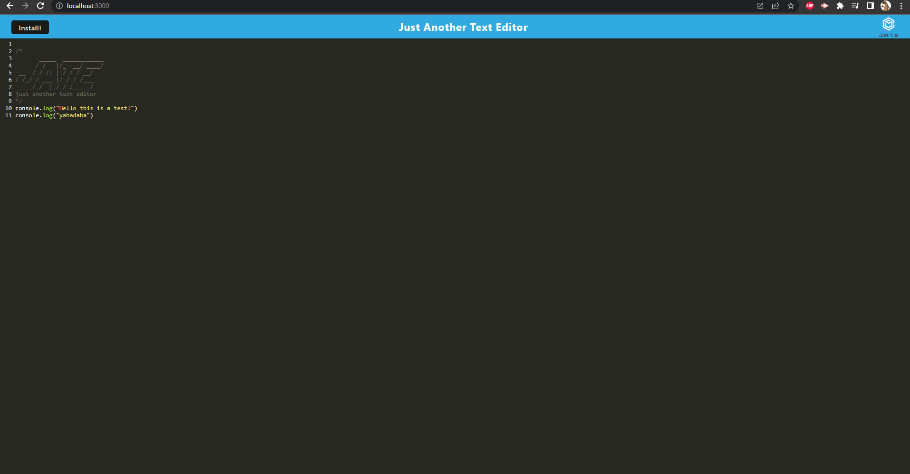
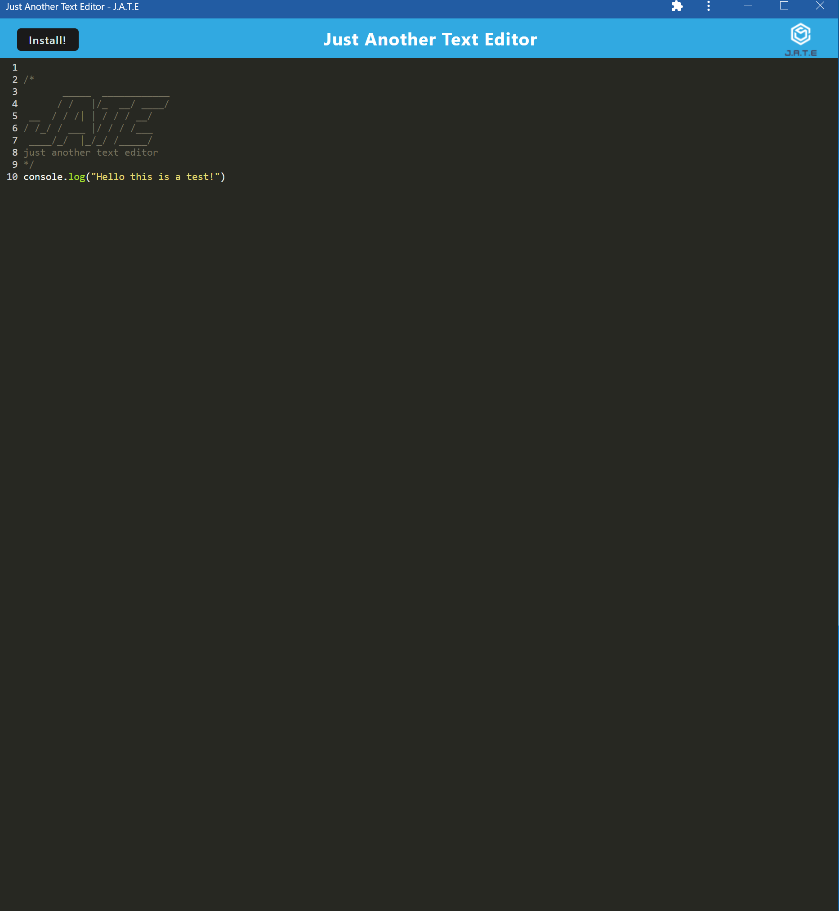
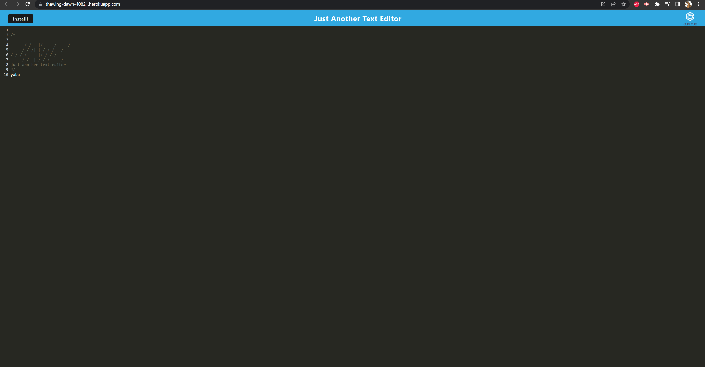

 # Text Editor
          
  

  ## Description
  The Text Editor

## Table of Contents
  * [Installation](#installation)
  * [Usage](#usage)
  * [License](#license)
  * [Contributing](#contributing)
  * [Tests](#tests)
  * [Questions](#questions)
          
## Installation
  The dependencies listed below must be installed to run this application.
  This project required Express, Webpack, Webpack-CLI, Babel, and the concurrently devDependency.

## Usage
  The instructions below will inform you how to use this application.
  To properly use the Text-Editor the user must run npm i and npm run start. The user will then open the application on the web. Once there the user can install the application and a window will appear where the user can write any text in the editor and it will appear in the storage.

localhost version
  
Installed Window Version
  
Heroku Version
  

## License
  This application uses the MIT license.

## Contributing
  Contributors: 
  I worked on this project alone but if you would like to contribute you can create a fork from my GitHub account and begin your work.

## Tests
  The tests below will show how the application is run.
  I didn’t include any tests.

## Questions
  If you have any questions about the application or repository please contact me at 
  https://github.com/CoreyVesey/README Generator or
  vesey8507@gmail.com
